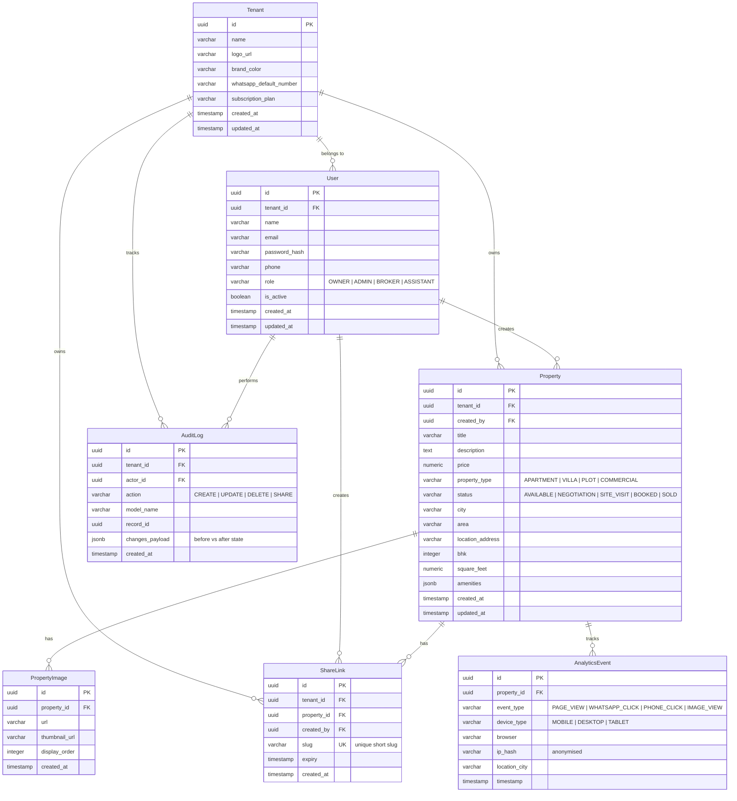

# Database Design Reference - PropertyOS

This document defines the relational database schema, data models, constraints, index strategies, and strict tenant isolation rules for **PropertyOS**.

---

## 1. Entity-Relationship (ER) Diagram

The diagram below maps out the schema relationships. Every primary transactional table contains a `tenant_id` foreign key to enforce logical multi-tenancy isolation.

---

## 2. Table Specifications & Schema Definitions

### 2.1. Tenant
The root workspace representing an agency, team, or individual broker brand.
* **Indexes:** 
  * Primary Key (`id` - UUID).

| Field | Data Type | Constraints | Description |
| :--- | :--- | :--- | :--- |
| `id` | UUID | PRIMARY KEY, Default: `gen_random_uuid()` | Unique tenant identifier. |
| `name` | VARCHAR(255) | NOT NULL | Brokerage or company name. |
| `logo_url` | VARCHAR(512) | NULLABLE | CDN link to the brand logo. |
| `brand_color` | VARCHAR(7) | DEFAULT '#0F172A' | Primary color in hex format (e.g., `#0F172A`). |
| `whatsapp_default_number` | VARCHAR(20) | NULLABLE | Default contact phone for WhatsApp redirection. |
| `subscription_plan` | VARCHAR(50) | DEFAULT 'FREE' | Tiering: `FREE`, `PRO`, `ENTERPRISE`. |
| `created_at` | TIMESTAMP WITH TZ| DEFAULT `NOW()` | Creation date. |
| `updated_at` | TIMESTAMP WITH TZ| DEFAULT `NOW()` | Last modification date. |

### 2.2. User
User records representing brokers, admins, assistants, or agency owners.
* **Indexes:**
  * Unique Constraint on `email` (case-insensitive index).
  * Index on `tenant_id` for fast workspace lookup.

| Field | Data Type | Constraints | Description |
| :--- | :--- | :--- | :--- |
| `id` | UUID | PRIMARY KEY, Default: `gen_random_uuid()` | Unique user identifier. |
| `tenant_id` | UUID | FOREIGN KEY -> `Tenant(id)`, ON DELETE CASCADE | Parent tenant workspace. |
| `name` | VARCHAR(255) | NOT NULL | Full name of the user. |
| `email` | VARCHAR(255) | NOT NULL, UNIQUE | Primary login identifier. |
| `password_hash` | VARCHAR(255) | NOT NULL | Securely hashed password. |
| `phone` | VARCHAR(20) | NULLABLE | Contact number (for SMS/OTP verification readiness). |
| `role` | VARCHAR(20) | NOT NULL, CHECK IN `('OWNER', 'ADMIN', 'BROKER', 'ASSISTANT')` | RBAC Role. |
| `is_active` | BOOLEAN | DEFAULT TRUE | Account state toggle. |
| `created_at` | TIMESTAMP WITH TZ| DEFAULT `NOW()` | Creation date. |
| `updated_at` | TIMESTAMP WITH TZ| DEFAULT `NOW()` | Last modification date. |

### 2.3. Property
The core inventory engine storing individual real estate records.
* **Indexes:**
  * Composite Index on `(tenant_id, status)` for rapid inventory filtering.
  * Index on `created_by` to list specific broker listings.
  * Index on `price` and `city` for queries.

| Field | Data Type | Constraints | Description |
| :--- | :--- | :--- | :--- |
| `id` | UUID | PRIMARY KEY, Default: `gen_random_uuid()` | Unique property identifier. |
| `tenant_id` | UUID | FOREIGN KEY -> `Tenant(id)`, ON DELETE CASCADE | Parent workspace. |
| `created_by` | UUID | FOREIGN KEY -> `User(id)`, ON DELETE SET NULL | The broker who listed it. |
| `title` | VARCHAR(255) | NOT NULL | Listing title (e.g. "Sleek 3 BHK Villa"). |
| `description` | TEXT | NOT NULL | Narrative marketing description. |
| `price` | NUMERIC(15,2) | NOT NULL, CHECK (`price >= 0`) | Listing price. |
| `property_type` | VARCHAR(50) | NOT NULL | Type: `APARTMENT`, `VILLA`, `PLOT`, `COMMERCIAL`. |
| `status` | VARCHAR(20) | DEFAULT 'AVAILABLE', CHECK | Status: `AVAILABLE`, `NEGOTIATION`, `SITE_VISIT`, `BOOKED`, `SOLD`. |
| `city` | VARCHAR(100) | NOT NULL | City location (e.g. "Pune"). |
| `area` | VARCHAR(100) | NOT NULL | Sub-locality (e.g. "Baner"). |
| `location_address`| TEXT | NULLABLE | Exact street address (optional). |
| `bhk` | INTEGER | NULLABLE, CHECK (`bhk >= 0`) | Number of bedrooms (if applicable). |
| `square_feet` | NUMERIC(10,2) | NULLABLE | Size in square feet. |
| `amenities` | JSONB | DEFAULT '{}'::jsonb | Flexible list of amenities (e.g. `["Pool", "Gym"]`). |
| `created_at` | TIMESTAMP WITH TZ| DEFAULT `NOW()` | Creation date. |
| `updated_at` | TIMESTAMP WITH TZ| DEFAULT `NOW()` | Last modification date. |

### 2.4. PropertyImage
Stores media associated with a property. Never store raw binary files in the database.
* **Indexes:**
  * Index on `property_id` for fast image retrieval.
  * Composite unique constraint on `(property_id, display_order)` to prevent order overlaps.

| Field | Data Type | Constraints | Description |
| :--- | :--- | :--- | :--- |
| `id` | UUID | PRIMARY KEY, Default: `gen_random_uuid()` | Image identifier. |
| `property_id` | UUID | FOREIGN KEY -> `Property(id)`, ON DELETE CASCADE | Parent property. |
| `url` | VARCHAR(512) | NOT NULL | URL to high-resolution optimized WebP image. |
| `thumbnail_url` | VARCHAR(512) | NOT NULL | URL to 400x300px thumbnail. |
| `display_order` | INTEGER | DEFAULT 0 | Ordering index for image gallery. |
| `created_at` | TIMESTAMP WITH TZ| DEFAULT `NOW()` | Date added. |

### 2.5. ShareLink
Generates clean, customizable, short marketing URLs for properties.
* **Indexes:**
  * Unique constraint on `slug` (index automatically generated).
  * Index on `tenant_id` for tenant link lists.

| Field | Data Type | Constraints | Description |
| :--- | :--- | :--- | :--- |
| `id` | UUID | PRIMARY KEY, Default: `gen_random_uuid()` | Link identifier. |
| `tenant_id` | UUID | FOREIGN KEY -> `Tenant(id)`, ON DELETE CASCADE | Parent tenant workspace. |
| `property_id` | UUID | FOREIGN KEY -> `Property(id)`, ON DELETE CASCADE | Referenced property. |
| `created_by` | UUID | FOREIGN KEY -> `User(id)`, ON DELETE SET NULL | The broker sharing the link. |
| `slug` | VARCHAR(100) | NOT NULL, UNIQUE | Custom URL slug (e.g., `modern-villa-baner`). |
| `expiry` | TIMESTAMP WITH TZ| NULLABLE | Optional link expiry date. |
| `created_at` | TIMESTAMP WITH TZ| DEFAULT `NOW()` | Creation date. |

### 2.6. AnalyticsEvent
Tracks interactions on the public property page without user authentication.
* **Indexes:**
  * Index on `property_id` to compute property-level statistics.
  * Index on `(event_type, timestamp)` for timeseries aggregations.

| Field | Data Type | Constraints | Description |
| :--- | :--- | :--- | :--- |
| `id` | UUID | PRIMARY KEY, Default: `gen_random_uuid()` | Event identifier. |
| `property_id` | UUID | FOREIGN KEY -> `Property(id)`, ON DELETE CASCADE | Target property. |
| `event_type` | VARCHAR(50) | NOT NULL | Type: `PAGE_VIEW`, `WHATSAPP_CLICK`, `PHONE_CLICK`, `IMAGE_VIEW`. |
| `device_type` | VARCHAR(20) | NOT NULL | Type: `MOBILE`, `DESKTOP`, `TABLET`. |
| `browser` | VARCHAR(100) | NULLABLE | User agent signature (parsed). |
| `ip_hash` | VARCHAR(64) | NOT NULL | Cryptographic salt-hash of IP for GDPR-safe unique count. |
| `location_city` | VARCHAR(100) | NULLABLE | Estimated city from IP geolocator. |
| `timestamp` | TIMESTAMP WITH TZ| DEFAULT `NOW()` | Event timestamp. |

### 2.7. AuditLog
Tracks data modifications across the system for security auditing.
* **Indexes:**
  * Index on `tenant_id` for workspace audit trails.
  * Index on `(model_name, record_id)` to audit specific records.

| Field | Data Type | Constraints | Description |
| :--- | :--- | :--- | :--- |
| `id` | UUID | PRIMARY KEY, Default: `gen_random_uuid()` | Log identifier. |
| `tenant_id` | UUID | FOREIGN KEY -> `Tenant(id)`, ON DELETE CASCADE | Target workspace. |
| `actor_id` | UUID | FOREIGN KEY -> `User(id)`, ON DELETE SET NULL | The user who performed the change. |
| `action` | VARCHAR(20) | NOT NULL | `CREATE`, `UPDATE`, `DELETE`, `SHARE`. |
| `model_name` | VARCHAR(100) | NOT NULL | Name of the table (e.g. `Property`). |
| `record_id` | UUID | NOT NULL | Primary key of the audited record. |
| `changes_payload`| JSONB | DEFAULT '{}'::jsonb | JSON structure comparing old vs new values. |
| `created_at` | TIMESTAMP WITH TZ| DEFAULT `NOW()` | Date of log. |

---

## 3. Tenant Isolation & Database Security Constraints

### 3.1. Tenant Column Constraint
Every database migration for tables in scope of multi-tenancy must enforce:
* A non-nullable `tenant_id` column referencing the `Tenant` table.
* On delete actions must be set to `CASCADE` or `RESTRICT` depending on domain safety rules (defaulting to `CASCADE` for transient tenant records, `RESTRICT` for critical configurations).

### 3.2. Indexing Strategy for Multi-Tenancy
To prevent cross-tenant queries from suffering performance degradation as the database grows:
* We will implement **composite indexes** prefixing the query parameters with `tenant_id`. For example:
  * `CREATE INDEX idx_prop_tenant_status ON properties (tenant_id, status);`
  * `CREATE INDEX idx_user_tenant ON users (tenant_id);`
  * `CREATE INDEX idx_share_tenant ON share_links (tenant_id);`
* In PostgreSQL, when querying by `tenant_id` and another column, a composite index allows the query planner to jump directly to the tenant's bucket, ensuring $O(\log N)$ scan times, isolated to that tenant's records.
