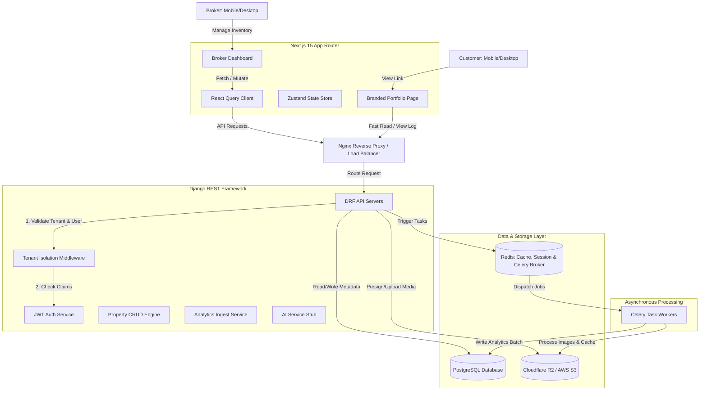

# System Architecture Reference - PropertyOS

This document details the architectural design, security protocols, and operational workflows for **PropertyOS**, a WhatsApp-first property marketing and inventory management operating system for real estate brokers.

---

## 1. System Integration Diagram

The following diagram illustrates the relationship between the client browser (broker/customer), the Next.js frontend, the Django REST API, and the auxiliary services (Database, Cache, Task Queue, and Object Storage).

---

## 2. Multi-Tier Technology Stack

| Layer | Component | Chosen Technology | Architectural Justification |
| :--- | :--- | :--- | :--- |
| **Frontend** | Application Framework | **Next.js 15 (App Router)** | Hybrid rendering capabilities (SSR/ISR) ensure public property pages load instantly, while the single-page application (SPA) dashboard provides a fluid desktop and mobile experience. |
| | Language | **TypeScript** | Strict compile-time typing prevents runtime exceptions, critical for scaling a commercial SaaS. |
| | Styling | **TailwindCSS** | Utility-first styling enabling fast, custom responsive layouts, allowing rapid mobile-first UI prototyping. |
| | UI Components | **Shadcn UI + Radix UI** | Accessible, unstyled primitives styled with Tailwind, giving full control over high-fidelity UI design. |
| | State Management | **Zustand** | Lightweight, boilerplate-free client-side state management for simple dashboard state. |
| | Server State | **React Query (TanStack)** | Robust caching, background refetching, and synchronization for API communications. |
| | Animations | **Framer Motion** | Premium, hardware-accelerated animations for a polished, modern feel. |
| **Backend** | API Framework | **Django REST Framework (DRF)** | Standardized REST pattern, mature ORM, built-in security, and fast speed of feature development. |
| | Language | **Python 3.12** | Industry standard for data-intensive web apps, offering high maintainability and rich library support (e.g., pillow for images, celery for tasks). |
| **Data & Cache**| Relational Database | **PostgreSQL** | ACID compliance, strong support for relational schemas, JSON fields for unstructured properties, and geospatial index support (PostGIS) for future location searches. |
| | Caching & Queues | **Redis** | In-memory key-value store acting as the Celery task broker, rate-limiter, and general-purpose cache. |
| **Background** | Task Processor | **Celery** | Offloads resource-heavy operations (image thumbnail generation, bulk email, analytics aggregation) to background worker processes, keeping the main request-response cycle fast. |
| **Storage** | Object Storage | **Cloudflare R2** | AWS S3 compatible storage with **zero egress fees**, resulting in massive cost savings for media-heavy real estate listings. Fallback: AWS S3. |
| **Hosting** | Containerization | **Docker & Docker Compose** | Guarantees environmental parity across local development, staging, and production environments. |

---

## 3. Core Architectural Patterns

### 3.1. Strict Tenant Isolation (Multi-Tenancy)
PropertyOS implements a **logical isolation model** using a shared database with a tenant-discriminator column (`tenant_id`). To guarantee that no tenant can ever view or mutate another tenant's data:
1. **Global Schema Filtering:** Every model representing tenant data inherits from a base `TenantModel` containing a foreign key to the `Tenant` table.
2. **Custom Manager:** A custom Django `TenantManager` is registered on all tenant models. This manager overrides the default queryset to automatically apply `.filter(tenant_id=current_tenant_id)`.
3. **Middleware Ingestion:** A Django middleware extracts the `tenant_id` from the authenticated user's JWT payload and binds it to thread-local storage or the request object.
4. **Validation Guardrails:** API views automatically enforce that any write/update operations validate the request payload's resources against the active tenant.

### 3.2. Media Upload & Processing Pipeline
To maintain a high-performance web app and prevent backend servers from choking on large image uploads:
1. **Upload Options:**
   * **Option A (Presigned URLs):** The frontend requests a presigned upload URL from the Django API, then uploads the image directly to Cloudflare R2/S3. This bypasses the Django server entirely, eliminating network bottlenecks.
   * **Option B (DRF Proxy + Celery):** If direct-to-S3 is restricted, Django accepts the upload, writes it to a temporary buffer, and immediately offloads processing to Celery.
2. **Asynchronous Image Optimization:** 
   * A Celery task triggers upon upload to optimize images.
   * Large images are resized to a maximum width of 1920px (standard HD) and compressed to **WebP** format.
   * A 400x300px thumbnail is generated for dashboard property cards.
   * Optimized images are saved back to R2, and the database record is updated.

### 3.3. High-Speed Portfolio Page Engine
Public-facing pages must load in `<2` seconds to avoid user dropoff:
* **Server-Side Rendering (SSR):** Next.js pre-renders the HTML on the server. The raw page contains minimal JavaScript, allowing immediate first contentful paint (FCP).
* **Caching Strategy:** Property pages are cached at the CDN/Edge level. When a broker updates a property, Next.js uses **Incremental Static Regeneration (ISR)** to revalidate and update the cached page in the background.

---

## 4. Security Architecture

### 4.1. Authentication & Authorization
* **JSON Web Tokens (JWT):** Secure, stateless authentication via `djangorestframework-simplejwt`. The frontend stores the access token in memory and the refresh token in an HTTP-only, secure, SameSite cookie to prevent cross-site scripting (XSS) and cross-site request forgery (CSRF) attacks.
* **Role-Based Access Control (RBAC):**
  * `OWNER`: Full administrative rights, including billing, tenant customization, and user deletion.
  * `ADMIN`: Can manage team members, edit inventory, and adjust tenant settings.
  * `BROKER`: Can create, edit, and share their own listings; can view shared agency listings.
  * `ASSISTANT`: Can input property details but cannot publish without approval (or has restricted sharing rights).

### 4.2. Network & API Protection
* **CORS Policy:** Strict Cross-Origin Resource Sharing rules. The Django API only accepts requests from registered frontend domains.
* **Rate Limiting:** Implemented via Django REST Framework throttle classes (backed by Redis) to limit public API abuse (e.g., spamming the analytics or auth endpoints).
* **Data Validation:** Pydantic-like strict serializer validations in DRF to sanitise all incoming JSON payloads, preventing SQL injection and XSS.

---

## 5. Scalability & Future Roadmap

* **Horizontal Scaling:** API servers and Celery workers are stateless and can be scaled horizontally behind an Nginx/ALB load balancer.
* **Database Optimization:** Read/write splitting can be introduced in PostgreSQL with read-replicas handling the high volume of public portfolio page loads, while the primary database handles mutations.
* **Edge Analytics:** Move analytics tracking from the database to an edge-worker (e.g., Cloudflare Workers) that flushes records in batches to a time-series database or analytics warehouse (e.g., ClickHouse), offloading Postgres completely.
