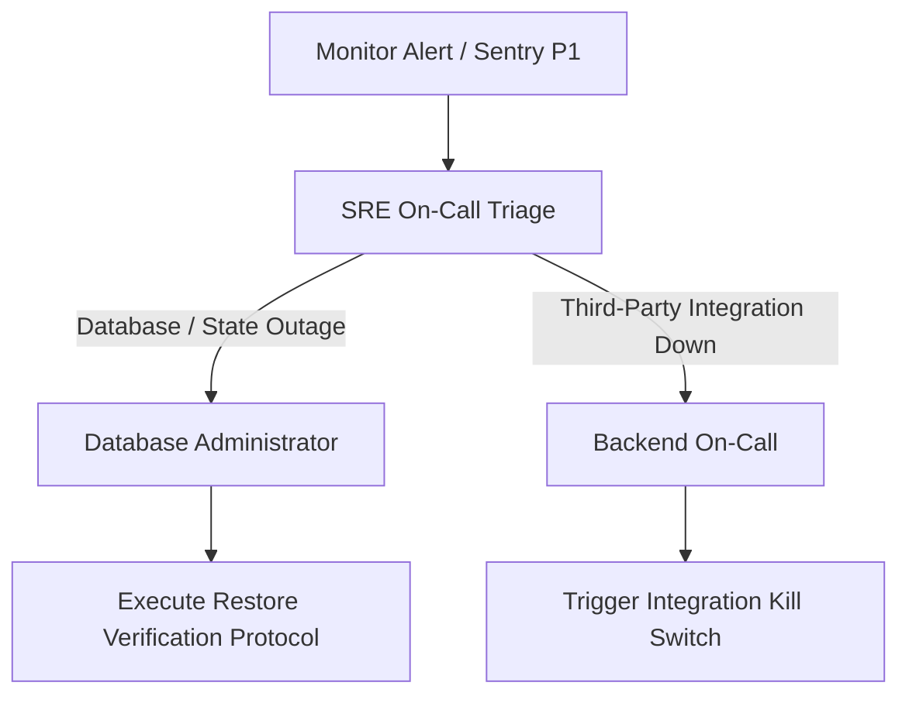

# PropertyOS Production Runbooks & Operational Standards

This operations document outlines standard protocols, runbooks, and disaster recovery SLA parameters for the PropertyOS SaaS platform.

---

## 1. SLA, SLO, and SLI Matrix

### Service Level Objectives (SLOs)
- **API Availability**: $\ge 99.9\%$ uptime per calendar month.
- **WhatsApp Sync Latency**: $95\%$ of messages processed and synced within 2 seconds.
- **Image Processing Throughput**: $99\%$ of listing uploads processed under 30 seconds.

### Service Level Indicators (SLIs)
- Rate of successful (non-5xx) HTTP requests measured at load balancer.
- Message processing queue latency measured in Celery/Redis queue depth.
- Average processing duration of `resize_image` task spans.

---

## 2. Disaster Recovery & Runbooks

### Target Metrics
- **Recovery Point Objective (RPO)**: **1 Hour** (maximum data loss window).
- **Recovery Time Objective (RTO)**: **4 Hours** (maximum target restore window).

### Incident Response Escalation Path


---

## 3. Playbook Protocols

### Playbook A: Database Outage & Restore Verification
In the event of a catastrophic database failure:
1. **Identify Failure**: Verify connection loss or data corruption alerts.
2. **Provision Fresh Database**: Create target Postgres instance in Render.
3. **Restore Last Backup**: Download nightly pg_dump from Cloudflare R2 bucket.
4. **Execute pg_restore**:
   ```bash
   pg_restore -h <host> -U <user> -d <db_name> backup_file.dump
   ```
5. **Run Security Compliance Verification**:
   Execute the audit log verifier command to check hash chain integrity:
   ```bash
   python manage.py verify_audit_log
   ```
   If errors are reported, trace the tampered records and notify Security.
6. **Deploy and Run Health Checks**: Verify `/api/health/` returns `200 OK`.

### Playbook B: Redis Cache / Sentinel Outage
If Redis cache is unresponsive:
1. Check Sentinel master logs to identify if a failover occurred.
2. If connection is refused:
   - Django settings fallback to local in-memory caching.
   - Throttling degrades to cache window locks; verify `AdvancedRateThrottle` allows normal clients.
3. Once Redis is recovered, restart Gunicorn workers to clear Sentinel reconnect states.

### Playbook C: Celery Worker & DLQ Replays
If worker queues become saturated or tasks fail repeatedly:
1. Identify failing task IDs via Sentry or Flower.
2. Check DLQ Redis list `celery_dlq:failed_tasks` to read poison payloads.
3. To replay failed tasks after a fix is deployed, execute the task replay management command:
   ```bash
   python manage.py replay_dlq_tasks
   ```

### Playbook D: Third-Party Integration Outages (Twilio / Gemini)
If external APIs fail:
1. **Gemini API Down**: Disable AI features by setting `FEATURE_ENABLE_AI=false` to bypass the pitch generator gracefully.
2. **Twilio Outage**: Set `FEATURE_ENABLE_WHATSAPP=false` to defer outbound WhatsApp marketing and queuing.
3. Tasks will bypass or degrade gracefully without throwing uncaught exceptions to users.

### Playbook E: Zero-Downtime Deployment Rollback
If a new release causes errors:
1. Trigger Docker container rollback in Render dashboard.
2. Do not rollback migrations if they are additive (Expand state).
3. If database state was modified, execute rollback scripts under safe guidelines (Ensure no columns are dropped until code is fully reverted).
